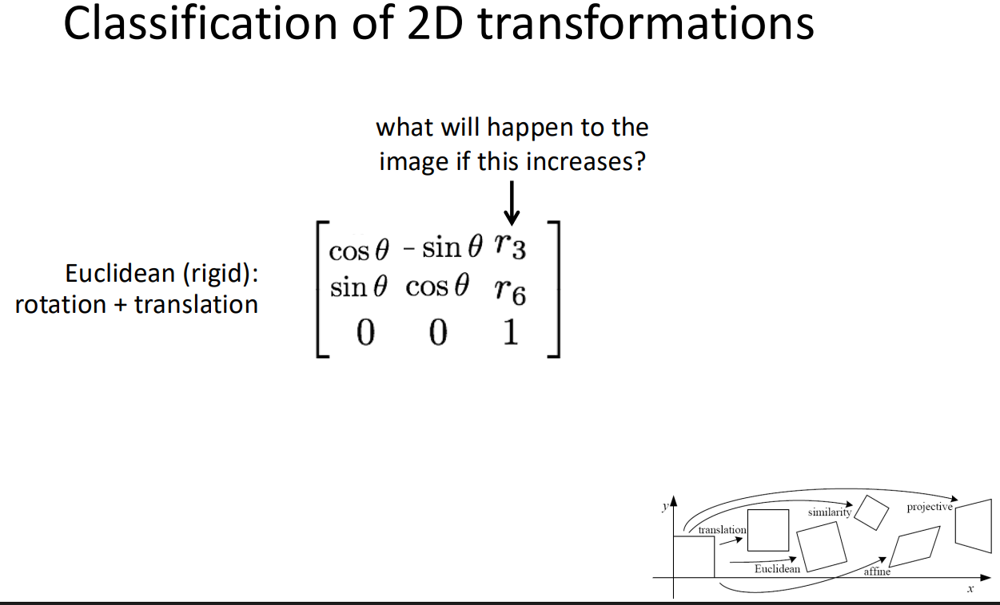
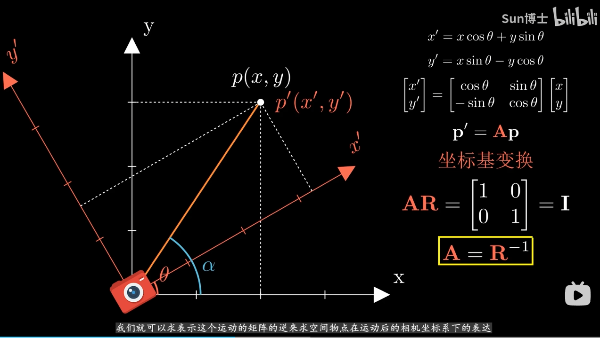

如果矩阵中的 $r_3$ 增加，图像将会向右平移（水平向右移动）。

这个问题取决于你是**仅仅单独改变矩阵左上角的这一个数值**，还是**改变了旋转角度 $\theta$ 从而导致 $\cos\theta$ 的值增加**。这两种情况对应的物理意义完全不同：

### 情况一：仅仅单独增加左上角的数值（改变了变换性质）
如果矩阵中的其他元素（$-\sin\theta$, $r_3$ 等）都保持不变，仅仅是左上角位置的值（我们记作 $m_{11}$）变大了，那么：
**图像会沿着水平方向（X轴）发生拉伸变形。**

**原因解释：**
根据矩阵乘法，变换后的新横坐标 $x'$ 的计算公式为：
$$x' = m_{11} \cdot x - y\sin\theta + r_3$$
如果 $m_{11}$ 增加，意味着原始图像的横坐标 $x$ 会被乘以一个更大的系数。这会导致图像在水平方向上被放大或拉宽。

*注：一旦你单独改变了这个值，这个矩阵就不再满足截图左侧标注的“Euclidean (rigid)”（欧几里得/刚体变换）条件了，因为它不再保持物体的原始形状，而是变成了一种包含非等比例缩放的仿射变换（Affine transformation）。*

### 情况二：旋转角度 $\theta$ 改变，导致 $\cos\theta$ 变大
如果矩阵依然严格保持为一个刚体变换矩阵（即矩阵中的两个 $\cos\theta$ 和两个 $\sin\theta$ 随着同一个角度联动变化），仅仅是因为角度 $\theta$ 变了使得 $\cos\theta$ 变大，那么：
**图像会顺时针旋转（或者说旋转的幅度变小，趋向于摆正）。**

**原因解释：**
在三角函数中，$\cos\theta$ 的最大值是 **1**（此时角度 $\theta = 0^\circ$）。
通常在逆时针旋转的设定下（如 $0^\circ$ 到 $90^\circ$ 的区间），角度 $\theta$ 越小，$\cos\theta$ 的值反而越大。
因此，如果 $\cos\theta$ 正在增加，说明旋转角度 $\theta$ 正在逐渐减小并逼近 $0^\circ$。在视觉上，这表现为图像正在消除原本的逆时针旋转，向顺时针方向转回它最开始、未旋转的原始状态。



---
## Part 2 — BLIP-2: Medical Image Captioning <a id='blip2'></a>

**BLIP-2** (Li et al., 2023, Salesforce) introduces a lightweight **Querying Transformer (Q-Former)** that bridges frozen image encoders with frozen LLMs, enabling both image captioning and VQA with minimal trainable parameters.

### Architecture
```
ViT (frozen) ──► Q-Former ──► Projection ──► FlanT5-XL (frozen) ──► Caption
                    ↑
              32 learned queries
```
第二个模型是 Salesforce 发布的 BLIP-2，它是当前最主流的视觉-语言模型架构之一。
BLIP-2 解决了一个关键问题：如何高效地把预训练好的视觉编码器和预训练好的语言模型桥接起来，同时保持两者参数冻结，只训练桥接层？它的答案是 Q-Former——查询变换器。Q-Former 使用 32 个可学习的查询向量，与图像特征进行交叉注意力，提取出固定维度的视觉摘要，再通过一层线性投影送入语言模型。
这个设计的妙处在于：无论输入图像多大，最终传给语言模型的视觉信息都只有 32 个 token，大幅降低了语言模型的计算负担，同时也让整个系统非常模块化——更换更强的图像编码器或语言模型都很方便。
